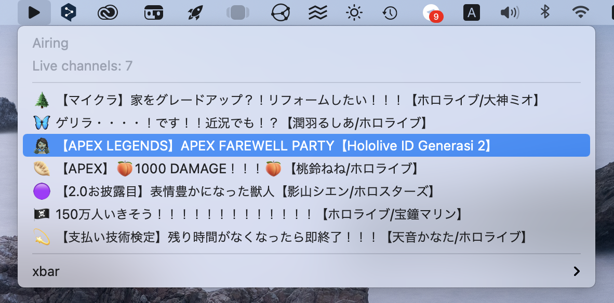

# Hololive xbar plugin

This is a plugin for the excellent [xbar app](https://xbarapp.com) that allows you to view information about Hololive live streams and channels, right in your macOS menu bar.

## Screenshots

## Usage/Examples

### Automatic install

Simply run `./install.sh`, this will copy over the plugin script into your `xbar` plugin folder.

Then simply refresh `xbar`.

## Roadmap

- Add upcoming live stream support

- Add channel info browser

- Allow to use Holodex API with your own API key

